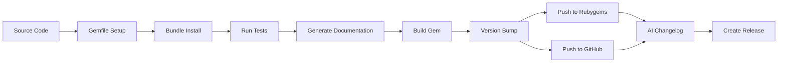
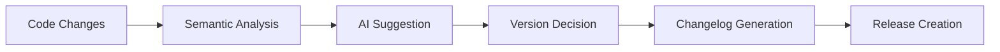
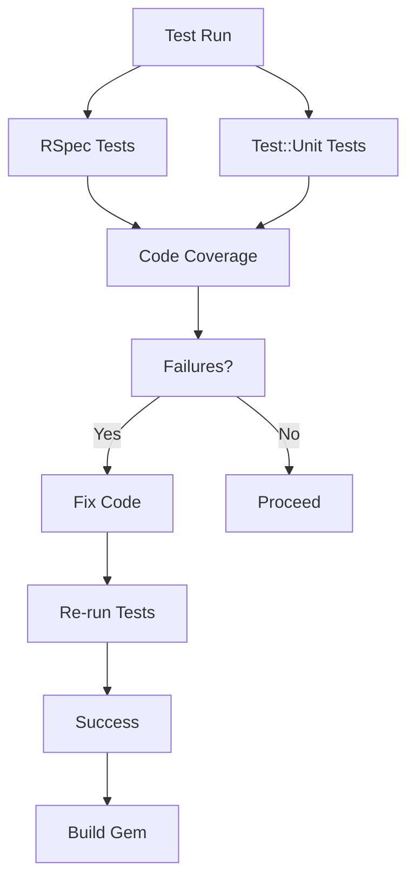

# GemHadar - building gems and more

## Description

The `gem_hadar` gem is a Ruby library that provides support for building gems
using rake tasks. It is a comprehensive Ruby gem automation tool that provides:

- **Automated gem building and packaging** - Complete build workflows with
  🛠️Rake task orchestration
- **Git workflow automation** - Version management, tagging, remote operations,
  and repository setup with 🔄git integration
- **GitHub release management** - Automated release creation with 🤖AI-powered
  changelog generation using Ollama
- **Testing framework integration** - Built-in support for RSpec, Test::Unit,
  and RCov code coverage testing with 🧪testing tools
- **Documentation generation** - YARD integration with private/public
  documentation tasks and coverage reporting with 📚documentation
- **RVM configuration management** - Automatic .rvmrc file generation for
  consistent development environments with 🎯RVM setup
- **CI/CD pipeline capabilities** - Complete workflows from build to publish
  with dependency management using ⚙️CI/CD automation
- **Semantic versioning automation** - 👾AI-powered version bump suggestions
  based on code changes
- **Extension compilation support** - Automatic compilation of C extensions
  when needed with 🏗️extension building
- **DSL-based configuration** - Simple block syntax in Rakefile for easy
  workflow setup with 📝configuration
- **Gemfile and .gitignore automation** - Automatic creation and management of
  essential project files with 📦dependency management

## Workflow Diagrams

### Gem Build Process


### AI Versioning Flow



### Testing Suite Overview



## Download

The source of this library is located at

* http://github.com/flori/gem_hadar

or can be installed via

```bash
$ gem install gem_hadar
```

## Configuration

### Environment Variables

The following environment variables can be used to configure `gem_hadar`:

| Variable | Description | Default |
|----------|-------------|---------|
| `GEM_HOST_API_KEY` | API key for gem hosting services | Not set |
| `GITHUB_API_TOKEN` | GitHub personal access token for releases | Not set |
| `OLLAMA_MODEL` | Ollama model name for AI generation | `llama3.1` |
| `OLLAMA_HOST` | Ollama server host URL | `localhost:11434` |
| `OLLAMA_URL` | Direct Ollama API URL (takes precedence over `OLLAMA_HOST`) | Not set |
| `OLLAMA_MODEL_OPTIONS` | JSON configuration for Ollama model | Not set |
| `HOME` | User's home directory (used for config file locations) | System default |
| `XDG_CONFIG_HOME` | XDG configuration directory override | System default |
| `MAKE` | Make program to use for building extensions | `gmake` or `make` |
| `VERSION` | Override the version string for some tasks | Not set |
| `FORCE` | Force certain operations (1 to enable) | 0 |
| `GIT_REMOTE` | Git remote name(s) for operations, space separated | `origin` |
| `GITHUB_RELEASE_ENABLED` | Enable GitHub releases (yes/no) | Auto-detected |
| `EDITOR` | Editor to use for interactive tasks | `vi` |

### Rubygems API

To publish gems to RubyGems.org, you'll need to set up an API key:

1. Generate a new API key at: https://rubygems.org/profile/api_keys/new
2. Set the environment variable:

```bash
export GEM_HOST_API_KEY="your_api_key_here"
```

**Security Note**: Never commit your API key to version control. Use a `.env`
file or your shell's configuration with appropriate loading mechanisms.

This key is required for tasks like `rake release` which push the gem package to RubyGems.org.

### Github API

To enable GitHub release creation and other GitHub API interactions, you'll
need to set up a personal access token.

1. Generate a new token at: https://github.com/settings/tokens/new
2. Grant it `repo` scope for full repository access
3. Set the environment variable:

```bash
export GITHUB_API_TOKEN="your_token_here"
```

**Security Note**: Never commit your token to version control. Use a `.env`
file or your shell's configuration with appropriate loading mechanisms.

This token is required for tasks like `rake github:release` which create GitHub
releases with AI-generated changelogs.

### Local Ollama AI

The gem supports AI-powered changelog generation using Ollama. To configure
this functionality:

1. Install and run Ollama locally: https://ollama.com/download
2. Pull the desired model (e.g., `ollama pull deepseek-r1:32b`)
3. Set the following environment variables:

```bash
export OLLAMA_HOST="http://localhost:11434"
export OLLAMA_MODEL="deepseek-r1:32b"
export OLLAMA_MODEL_OPTIONS='{"num_ctx":16384,"seed":-1,"num_predict":512,"temperature":0.4,"top_p":0.95,"top_k":20,"min_p":0}'
```

The default model is `llama3.1` and the default host is
`http://localhost:11434`. These can be overridden based on your local Ollama
setup.

The model options example configures:

- `num_ctx`: Context window size (16384 tokens)
- `temperature`: Response randomness (0.4 for balanced output)
- `num_predict`: Maximum tokens to generate (512)
- `top_p`, `top_k`, `min_p`: Sampling parameters for controlled generation

This functionality is used by the `rake github:release` and `rake version:bump`
task to generate AI-powered changelogs or suggest a version bump.

### Custom AI Prompts

To customize the AI prompts used by `gem_hadar`, you can override the default
prompt files in your XDG configuration directory.

First, display the current default prompts using:

```bash
$ rake gem_hadar:config
```

This will show you the `XDG_CONFIG_HOME`, default system and user prompts for
version bumping and release generation. The output includes the exact template
variables that are available for use in your custom prompts.

Then, create the following files in your XDG configuration home directory:

- `version_bump_system_prompt.txt`
- `version_bump_prompt.txt` 
- `release_system_prompt.txt`
- `release_prompt.txt`

Start with the default values shown by `rake gem_hadar:config` and modify them
to suit your needs. The prompts support standard Ruby string interpolation with
the following variables:

For version bump prompts:
- `%{version}` - Current gem version
- `%{log_diff}` - Git diff of changes

For release prompts:
- `%{name}` - Gem name
- `%{version}` - New version being released
- `%{log_diff}` - Git diff of changes

This approach ensures your custom prompts work correctly with the template
variables while maintaining consistency with the gem's expected input format.

### Output current configuration

To debug or verify your `gem_hadar` configuration, you can use the following
rake task:

```bash
$ rake gem_hadar:config
```

This task displays all current configuration values including:
- GitHub API token (masked)
- RubyGems API key (masked)  
- Ollama model settings
- Repository information (gem name, version)
- Build parameters (MAKE, EDITOR)
- Git configuration (remote)
- Other flags (FORCE, VERSION, GITHUB_RELEASE_ENABLED)
- XDG/HOME directories
- AI prompt defaults

## Usage

### Pre-requisites

Before using `gem_hadar`, ensure you have initialized a Git repository in your
project directory. Many of the gem's commands assume Git is available and
properly configured in the current working directory.

### Quick Start with Generator

Create a new directory and execute:

```bash
$ gem_hadar
```

This generates a basic gem structure with a Rakefile. Edit the generated Rakefile until:

```bash
$ rake gemspec
```

and then

```bash
$ rake build
```

are performed as desired.

### YARD Documentation

`gem_hadar` supports generating YARD documentation. To generate documentation, run:

```bash
$ rake doc
```

This will create documentation in the `doc` directory using YARD.

### Rakefile Configuration Example

For more advanced control, here's a complete Rakefile configuration example:

```ruby
# Rakefile
require 'gem_hadar'

GemHadar do
  # Set developing to true if you don't have a homepage set yet
  #developing true

  name        'mygemname'
  path_name   'mygem'
  path_module 'Mygem'
  author      'My name'
  email       'my@mail'
  homepage    "https://github.com/younameit/mygem"
  summary     'Precious gem'
  description 'Precious detailed gem'
  test_dir    'spec'
  ignore      'pkg', 'Gemfile.lock', '.DS_Store'

  readme      'README.md'
  title       "#{name.camelize} -- My library"
  licenses    << 'Apache-2.0'

  dependency             'sinatra', '~> 3.2'
  development_dependency 'rake'
  development_dependency 'rspec'
end
```

Note that `gem_hadar` is ["self hosted"](Rakefile)

### Configuration settings in the GemHadar block

#### Core Required Attributes (Mapped to GemSpec)

- **`name`** - Required gem name (raises error if not set)
- **`version`** - Required version with fallback to `VERSION` file or ENV override
- **`authors`** - Required author names (mapped from `author`)
- **`email`** - Required author email (raises error if not set)
- **`homepage`** - Required homepage URL (raises error if not set). **Validation**: When `developing` is false, validates that the URL returns an HTTP OK status after following redirects.
- **`summary`** - Required summary description (raises error if not set)
- **`description`** - Required full description (raises error if not set)

#### Core Recommended Attributes

- **`licenses`** - Default: `Set[]`. License information for the gem
- **`required_ruby_version`** - Default: `nil`. Ruby version requirement

#### Build and Package Configuration

- **`require_paths`** - Default: `Set['lib']` (mapped to `require_paths`)
- **`test_dir`** - Default: `nil`
- **`spec_dir`** - Default: `nil`
- **`extensions`** - Default: `FileList['ext/**/extconf.rb']` (mapped to `extensions`)
- **`make`** - Default: `ENV['MAKE']` or system detection
- **`executables`** - Default: `Set[]` (mapped to `executables`)
- **`ignore_files`** - Default: `Set[]`
- **`package_ignore_files`** - Default: `Set[]`

#### Documentation and Files

- **`readme`** - Default: `nil`
- **`title`** - Default: `nil`
- **`doc_files`** - Default: `nil`
- **`yard_dir`** - Default: `nil`

#### Testing Configuration

- **`test_files`** - Default: `nil`
- **`spec_pattern`** - Default: `nil`
- **`bindir`** - Default: `nil` (mapped to `bindir`)

#### RVM Configuration (Nested)

```ruby
rvm do
  use     # Default: detected ruby version from `rvm tools strings`
  gemset  # Default: gem name
end
```

#### Task Dependencies

- **`default_task_dependencies`** - Default: `[:gemspec, :test]`
- **`build_task_dependencies`** - Default: `[:clobber, :gemspec, :package, :'version:tag']`
- **`push_task_dependencies`** - Default: `[:modified, :build, :master:push, :version:push, :gem:push, :github:release]`

#### Configuration Flags

- **`developing`** - Default: `false`. When set to `true`, skips URL validation including homepage link verification for faster development cycles.

### Paths and Module Types

- **`path_name`** - Default: `name`. Returns the raw gem name value by default.
  It is used for generating file paths and module names. This is particularly
  useful for creating consistent directory structures and file naming
  conventions. It's used internally by `GemHadar` to create the root directory
  for the gem (`lib/my_gem` for name "my\_gem") and generate a `version.rb` file
  in that location.

  This can be changed for nested namespaces if desired.

  **Example**: For gems in namespaces like `ACME` like
  `ACME::BrainfuckCompiler`, you might set `path_name` to
  `"acme/brainfuck_compiler"` to create the directory structure
  `lib/acme/brainfuck_compiler/`.

- **`path_module`** - Default: `path_name.camelize`. Automatically converts the
  gem name to CamelCase format (e.g., "my\_gem" becomes "MyGem",
  "namespace/my\_gem" becomes "Namespace::MyGem") for use in Ruby module and
  class declarations, ensuring consistency with Ruby naming
  conventions. This value can be overridden if needed.

- **`module_type`** - Default: `:module`. Determines whether the generated code
  structure for the version module should be a `:module` or `:class`. This
  controls the type of Ruby construct created when generating code skeletons and
  version files. The value
  can be set to either:

    - `:module` (default) - Generates module-based structure
    - `:class` - Generates class-based structure

    This is used in the generated `version.rb` file to create either:
    ```ruby
    module MyGem
      # ... version constants
    end
    ```
    or
    ```ruby
    class MyGem
      # ... version constants
    end
    ```

These computed values serve as intelligent defaults that can be overridden
based on your specific requirements. They are automatically derived from other
DSL accessors and provide powerful convenience features that enable `GemHadar`
to generate consistent, well-structured Ruby code automatically.

### Available Tasks

You can list all available tasks with:

```bash
$ rake -T
```

#### Core Tasks

- `rake build` - Build task (builds all packages for a release)
- `rake release` - Release the new version 1.2.3 for the gem foo

#### Build Tasks

- `rake gemspec` - Create a gemspec file
- `rake package` - Build all the packages
- `rake gem` - Build the gem file foo-1.2.3.gem
- `rake clobber` - Remove any generated files
- `rake clobber_package` - Remove package products
- `rake repackage` - Force a rebuild of the package files

#### Version Management

- `rake version` - Writing version information for foo
- `rake version:show` - Displaying the current version
- `rake version:list` - List all versions in order
- `rake version:diff` - Displaying the diff from env var VERSION to the next version or HEAD
- `rake version:tag` - Tag this commit as version 1.2.3
- `rake version:bump` - Bump version with AI suggestion
- `rake version:bump:major` - Bump major version
- `rake version:bump:minor` - Bump minor version
- `rake version:bump:build` - Bump build version
- `rake version:push` - Push version 1.2.3 to all git remotes: origin
- `rake version:origin:push` - Push version 1.2.3 to git remote origin

#### Documentation

- `rake doc` - Create yard documentation (including private)
- `rake yard_doc` - Generate YARD Documentation
- `rake yard:doc` - Create yard documentation
- `rake yard:private` - Create yard documentation (including private)
- `rake yard:public` - Create yard documentation
- `rake yard:clean` - Clean the yard documentation
- `rake yard:view` - View the yard documentation
- `rake yard:list-undoc` - List all undocumented classes/modules/methods

#### Testing & Development

- `rake run_specs` - Run RSpec code examples
- `rake clean` - Remove any temporary products
- `rake gems:install` - Install all gems from the Gemfile
- `rake gem_hadar:update` - Update `gem_hadar` to a different version
- `rake rvm` - Create .rvmrc file
- `rake default` - Default task
- `rake compile` - Compile project extensions (if configured)

#### Publishing Tasks
- `rake push` - Push all changes for version 1.2.3 into the internets
- `rake github:release` - Create a new GitHub release for the current version
  with AI-generated changelog

### Update Version

Use one of the following rake tasks to bump the version:

- `rake version:bump:major` - Bump major version (e.g., 1.2.3 → 2.0.0)
- `rake version:bump:minor` - Bump minor version (e.g., 1.2.3 → 1.3.0)  
- `rake version:bump:build` - Bump build version (e.g., 1.2.3 → 1.2.4)
- `rake version:bump` - Get AI-powered suggestion for appropriate bump level

Or bump your [VERSION](./VERSION) file by hand.

### Release

```bash
$ rake build
```

This command will execute a series of dependent tasks in order: cleaning
previous builds, generating the gem specification, packaging the gem, and
creating a git tag with the current version in git.

After all the files have been changed correctly and the git tags have been
moved forward to the appropriate commit you can finally enter:

```bash
$ rake release
```

The `rake release` command performs the final publishing steps: pushing the
master branch and version tag to all git remotes, pushing the gem package to
RubyGems.org, and creating a GitHub release with AI-generated changelog.

## Author

**GemHadar** was written by [Florian Frank](mailto:flori@ping.de).

## License

This software is licensed under the [MIT](./LICENSE) license.
