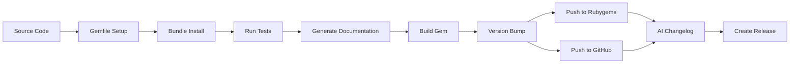
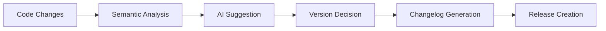
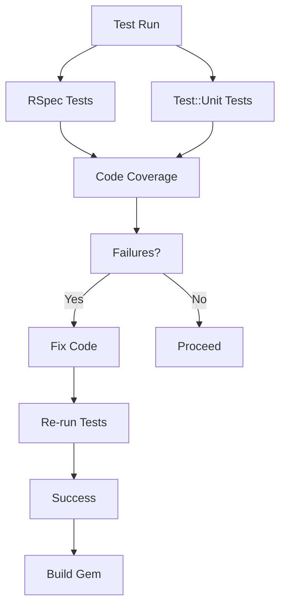

# GemHadar - building gems and more

## Description

The `gem_hadar` gem is a Ruby library that provides support for building gems
using rake tasks. It is a comprehensive Ruby gem automation tool that provides:

- **Automated gem building and packaging** - Complete build workflows with
  🛠️Rake task orchestration
- **Git workflow automation** - Version management, tagging, remote operations,
  and repository setup with 🔄git integration
- **GitHub release management** - Automated release creation with 🤖AI-powered
  changelog generation using Ollama
- **Testing framework integration** - Built-in support for RSpec, Test::Unit,
  and RCov code coverage testing with 🧪testing tools
- **Documentation generation** - YARD integration with private/public
  documentation tasks and coverage reporting with 📚documentation
- **RVM configuration management** - Automatic .rvmrc file generation for
  consistent development environments with 🎯RVM setup
- **CI/CD pipeline capabilities** - Complete workflows from build to publish
  with dependency management using ⚙️CI/CD automation
- **Semantic versioning automation** - 👾AI-powered version bump suggestions
  based on code changes
- **Extension compilation support** - Automatic compilation of C extensions
  when needed with 🏗️extension building
- **DSL-based configuration** - Simple block syntax in Rakefile for easy
  workflow setup with 📝configuration
- **Gemfile and .gitignore automation** - Automatic creation and management of
  essential project files with 📦dependency management

## Workflow Diagrams

### Gem Build Process


### AI Versioning Flow



### Testing Suite Overview



## Download

The source of this library is located at

* http://github.com/flori/gem\_hadar

or can be installed via

```bash
$ gem install gem_hadar
```

## Usage

### Pre-requisites

Before using `gem_hadar`, ensure you have initialized a Git repository in your
project directory. Many of the gem's commands assume Git is available and
properly configured in the current working directory.

### Quick Start with Generator

Create a new directory and execute:

```bash
$ gem_hadar
```

This generates a basic gem structure with a Rakefile. Edit the generated Rakefile until:

```bash
$ rake gemspec
```

and then

```bash
$ rake build
```

are performed as desired.

### YARD Documentation

`gem_hadar` supports generating YARD documentation. To generate documentation, run:

```bash
$ rake doc
```

This will create documentation in the `doc` directory using YARD.

### Rakefile Configuration Example

For more advanced control, here's a complete Rakefile configuration example:

```ruby
# Rakefile
require 'gem_hadar'

GemHadar do
  # Set developing to true if you don't have a homepage set yet
  #developing true

  name        'mygemname'
  path_name   'mygem'
  path_module 'Mygem'
  author      'My name'
  email       'my@mail'
  homepage    "https://github.com/younameit/mygem"
  summary     'Precious gem'
  description 'Precious detailed gem'
  test_dir    'spec'
  ignore      'pkg', 'Gemfile.lock', '.DS_Store'

  readme      'README.md'
  title       "#{name.camelize} -- My library"
  licenses    << 'Apache-2.0'

  dependency             'sinatra', '~> 3.2'
  development_dependency 'rake'
  development_dependency 'rspec'
end
```

Note that `gem_hadar` is ["self hosted"](Rakefile)

### Available Tasks

You can list all available tasks with:

```bash
$ rake -T
```

#### Core Tasks

- `rake build` - Build task (builds all packages for a release)
- `rake release` - Release the new version 1.2.3 for the gem foo

#### Build Tasks

- `rake gemspec` - Create a gemspec file
- `rake package` - Build all the packages
- `rake gem` - Build the gem file foo-1.2.3.gem
- `rake clobber` - Remove any generated files
- `rake clobber_package` - Remove package products
- `rake repackage` - Force a rebuild of the package files

#### Version Management

- `rake version` - Writing version information for foo
- `rake version:show` - Displaying the current version
- `rake version:list` - List all versions in order
- `rake version:diff` - Displaying the diff from env var VERSION to the next version or HEAD
- `rake version:tag` - Tag this commit as version 1.2.3
- `rake version:bump` - Bump version with AI suggestion
- `rake version:bump:major` - Bump major version
- `rake version:bump:minor` - Bump minor version
- `rake version:bump:build` - Bump build version
- `rake version:push` - Push version 1.2.3 to all git remotes: origin
- `rake version:origin:push` - Push version 1.2.3 to git remote origin

#### Documentation

- `rake doc` - Create yard documentation (including private)
- `rake yard_doc` - Generate YARD Documentation
- `rake yard:doc` - Create yard documentation
- `rake yard:private` - Create yard documentation (including private)
- `rake yard:public` - Create yard documentation
- `rake yard:clean` - Clean the yard documentation
- `rake yard:view` - View the yard documentation
- `rake yard:list-undoc` - List all undocumented classes/modules/methods

#### Testing & Development

- `rake run_specs` - Run RSpec code examples
- `rake clean` - Remove any temporary products
- `rake gems:install` - Install all gems from the Gemfile
- `rake gem_hadar:update` - Update `gem_hadar` to a different version
- `rake rvm` - Create .rvmrc file
- `rake default` - Default task
- `rake compile` - Compile project extensions (if configured)

#### Publishing Tasks
- `rake push` - Push all changes for version 1.2.3 into the internets
- `rake github:release` - Create a new GitHub release for the current version
  with AI-generated changelog

### Update Version

Use one of the following rake tasks to bump the version:

- `rake version:bump:major` - Bump major version (e.g., 1.2.3 → 2.0.0)
- `rake version:bump:minor` - Bump minor version (e.g., 1.2.3 → 1.3.0)  
- `rake version:bump:build` - Bump build version (e.g., 1.2.3 → 1.2.4)
- `rake version:bump` - Get AI-powered suggestion for appropriate bump level

Or bump your [VERSION](./VERSION) file by hand.

### Release

```bash
$ rake build
```

This command will execute a series of dependent tasks in order: cleaning
previous builds, generating the gem specification, packaging the gem, and
creating a git tag with the current version in git.

After all the files have been changed correctly and the git tags have been
moved forward to the appropriate commit you can finally enter:

```bash
$ rake release
```

The `rake release` command performs the final publishing steps: pushing the
master branch and version tag to all git remotes, pushing the gem package to
RubyGems.org, and creating a GitHub release with AI-generated changelog.

## Author

**GemHadar** was written by [Florian Frank](mailto:flori@ping.de).

## License

This software is licensed under the [MIT](./LICENSE) license.
